### 主旨

- 平台监控


### 架构


#### 官方参考架构


### 说明

#### 登录地址

```
// prometheus
http://${IP}:9090/

// alertmanager
http://${IP}:9093/

// grafana
http://${IP}:3000/
```

#### prometheus

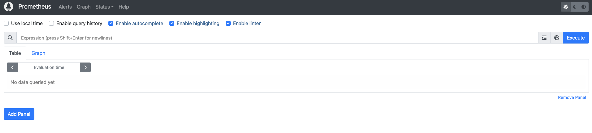

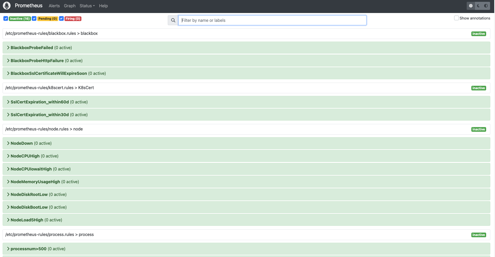

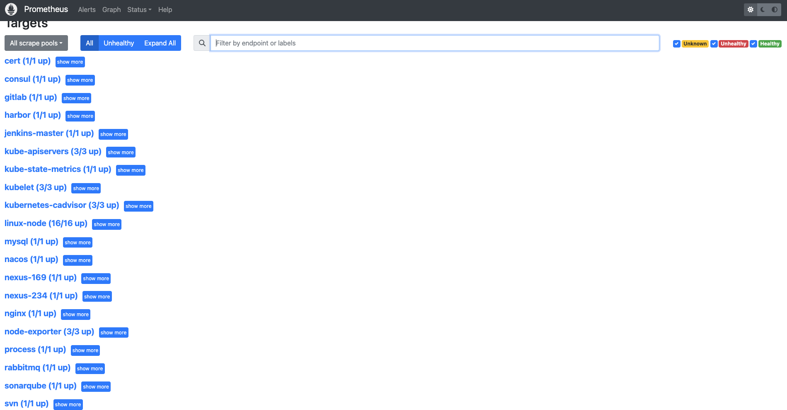


#### alermanager

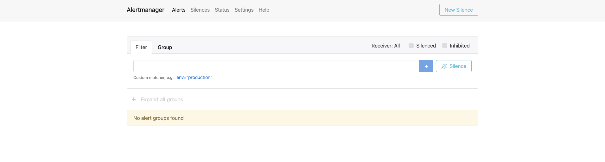

#### grafana

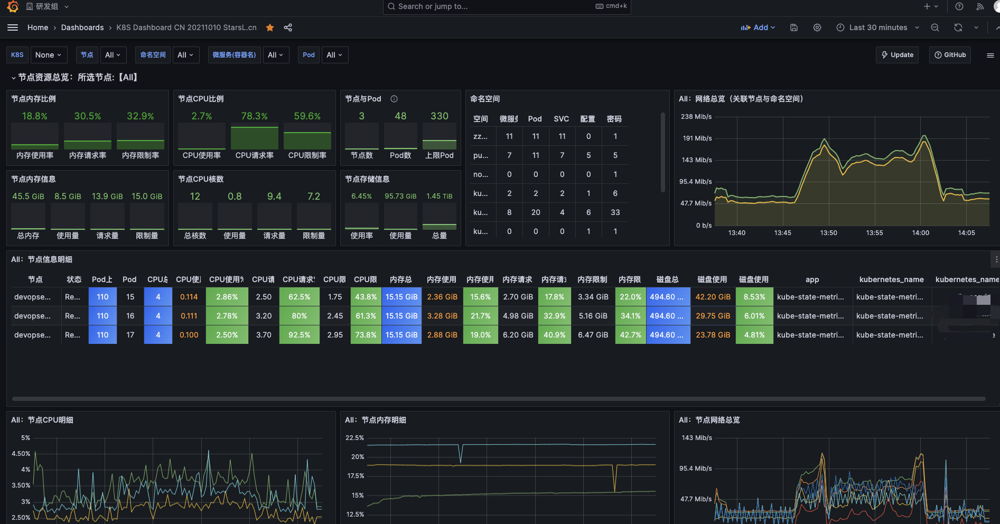

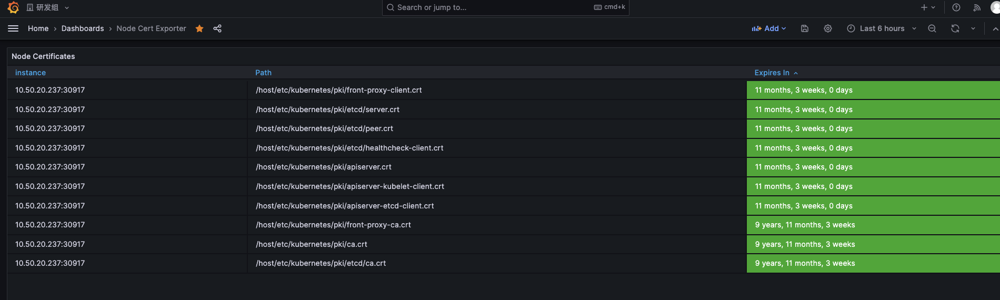

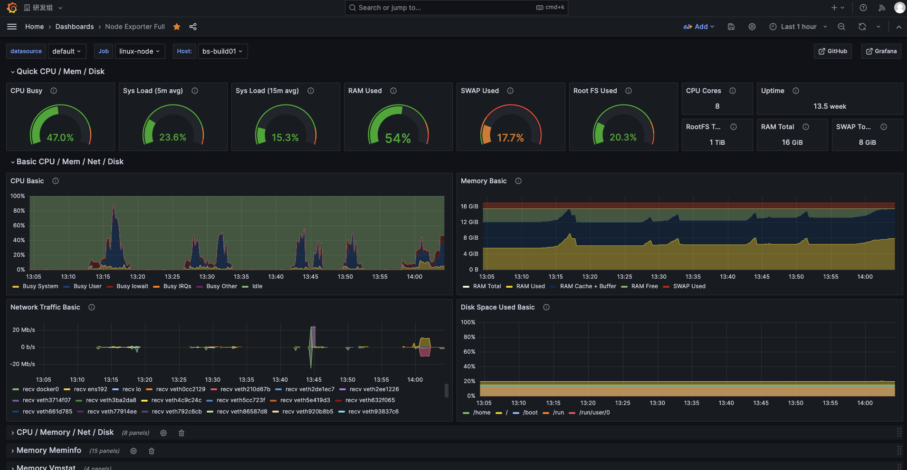

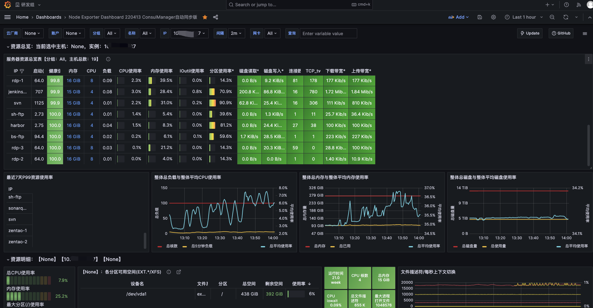

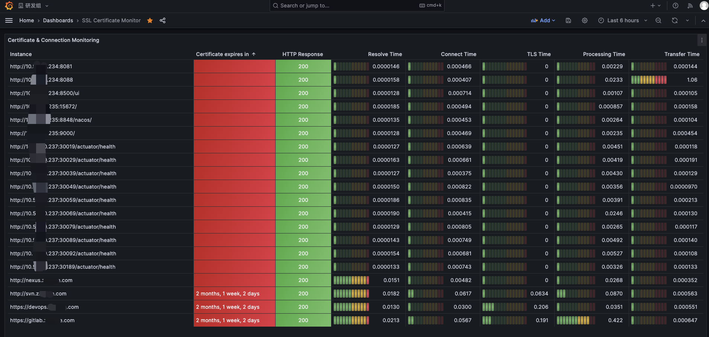

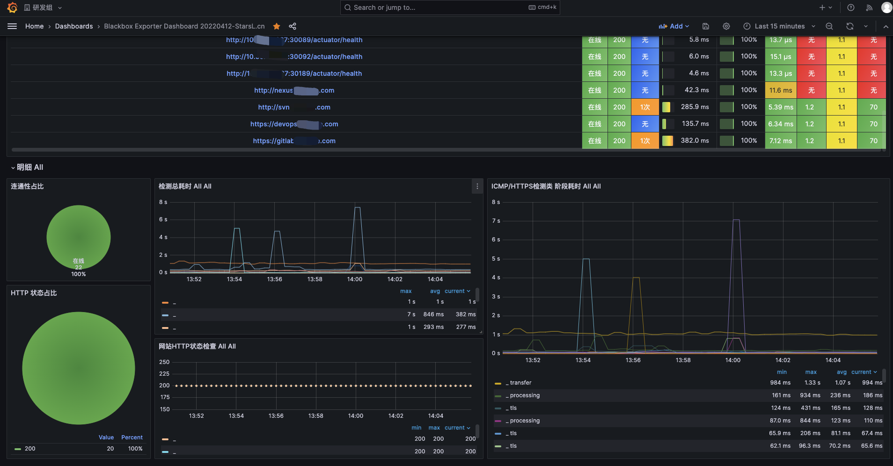

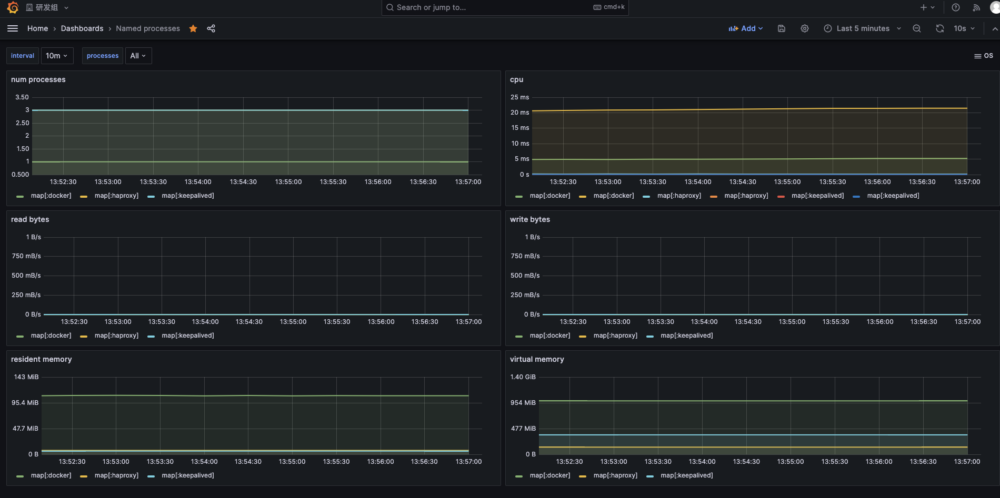

#### mail

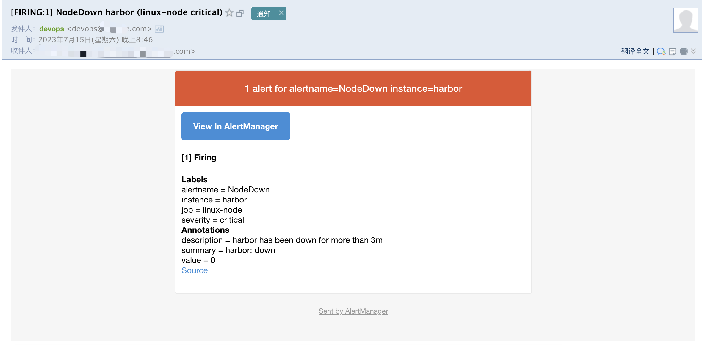


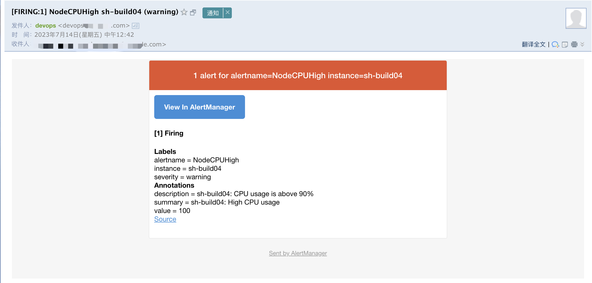

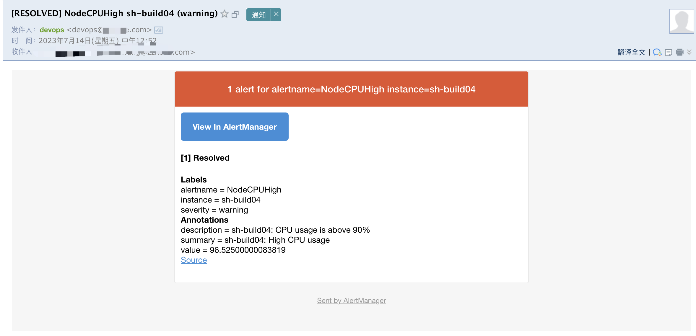

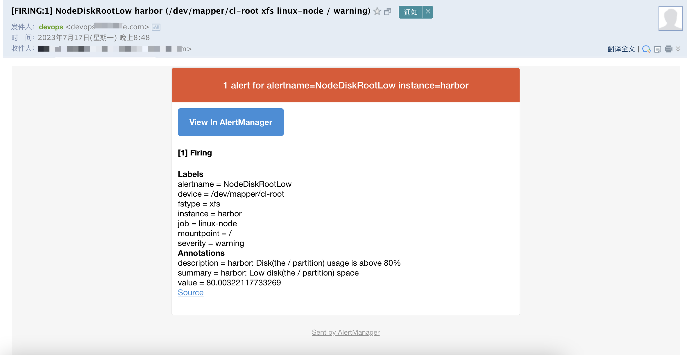

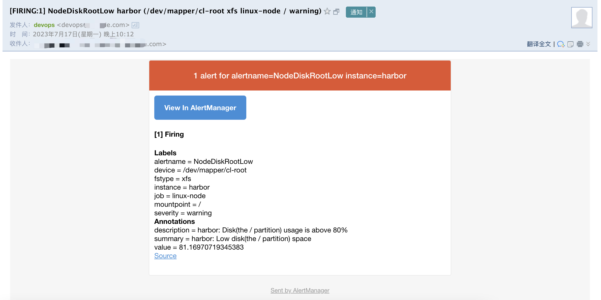


### 主机监控

#### 主机监控优化

#### 监控探针服务自启动


### 中间件监控

### 进程监控

### k8s证书有效期监控


###  告警规则

#### prometheus规则

##### node告警规则

##### k8s证书告警规则

##### blackbox告警规则

##### process告警规则

#### alertmanager规则

#### 邮件分组通知策略


### grafana相关

#### 常用模版

#### 数据持久化

#### 用户权限


### 日志增长量

```
[root@devopsecs005 data]# date
Wed Jul 19 16:46:37 CST 2023
[root@devopsecs005 data]# du -sh nfs-volume metrics-data
258M    nfs-volume
2.6G    metrics-data
[root@devopsecs005 data]# 
```

```
[root@devopsecs005 data]# date
Tue Jul 18 13:47:57 CST 2023
[root@devopsecs005 data]# du -sh nfs-volume metrics-data
258M    nfs-volume
2.3G    metrics-data
[root@devopsecs005 data]# 
```


### 历史事件

#### 2023-07-19｜提交到GitHub

#### 2023-07-14｜邮件告警演示

#### 2022-11-19｜配置Grafana监控模版

#### 2022-11-19｜邮件分组通知配置

#### 2022-11-18｜增加进程监控及告警规则

#### 2022-11-17｜k8s证书监控

#### 2022-11-05｜创建说明文档
